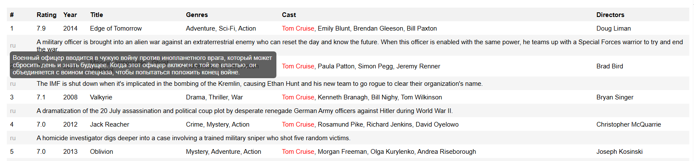

# for-review-ru
Мои решение различных задач

### SQL, Python

В рамках одного из проектов "IT Career Hub" нужно было реализовать следующую задачу:
Создание консольного приложения для поиска фильмов по базе данных movies.
В качестве источника данных можно использовать копию [этой базы](https://github.com/it-career-hub/MySQL_databases/blob/main/imdb.movies.sql)
Все введенные поисковые запросы сохраняются.

**Цель проекта**
Реализовать сценарии поиска фильмов:
-  По ключевому слову находится 10+ фильмов (параллельно в историю запросов записывается искомое ключевое слово)
-  По жанру и году находится 10+ фильмов
-  По команде выводится список самых популярных запросов, по которым был поиск

[результат работы блокнота в виде html](project_sql.html)
Ищем в базе фильмов по ключевому слову `Tom Cruise`

**исходный код моего решения**
[project_sql.ipynb](project_sql.ipynb) - основной jupyter notebook
[utils_project.py](utils_project.py)  -  вспомогательный скрипт

### Tableau

В рамках прохождения курса Дата-аналитик в компании "IT Career Hub" выполнены задания по созданию Дашбордов на основе предоставленных данных
- [Superstore High-Level Dashboard](https://public.tableau.com/app/profile/pavel.orlov/viz/SuperstoreHigh-LevelDashboard_17173075920250/SuperDashboard)
- [Project Flight Delays](https://public.tableau.com/app/profile/pavel.orlov/viz/ProjectFlightDelays_17177708924460/Dashboard2)

### Анализ данных, Продуктовая аналитика 

В рамках финального проекта в "IT Career Hub" нужно было произвести анализ данных по предоставленным данным.

Работа была выполнена в трех разных блокнотах
- [eda.ipynb](eda.ipynb) - предварительный анализ данных
- [preprocessing.ipynb](preprocessing.ipynb) - подготовка данных для дальнейшего анализа
- [project.ipynb](project.ipynb) - финальный анализ данных и продуктовая аналитика -> [project.html](project.html) - результат финального анализа в виде html (тот же блокнот в другом формате)

### Spark

Задача состояла в том, чтобы ускорить выполнения pipeline по обработке данных для расчета признаков retention. А также уменьшить объем этих данных для хранения.
В дальнейшем эти признаки могут использоваться как для анализа данных, так и для машинного обучения.
Задача была выполнена с помощью использования битовых операций Spark.
Основная идея алгоритма взята из [видео](https://www.youtube.com/watch?v=DQefW9sNmw0&t=7108s) дата-инженера Zach Wilson

Блокнот с решением
[spark_bitwise.ipynb](spark_bitwise.ipynb)

### Сертификаты

[Сертификаты](https://drive.google.com/drive/u/0/folders/1sPV78LM4puSXZvzIKcjwM1ETdjbfFHAT) полученные после успешного прохождения курса "Дата-аналитик" в компании "IT Career Hub GmbH"

